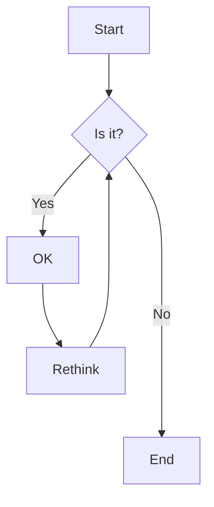

# MDX Style Test

This is a sample .mdx file to test various Markdown and MDX elements.

## Headings

# Heading 1
## Heading 2
### Heading 3
#### Heading 4
##### Heading 5
###### Heading 6

## Text Formatting

This is **bold text**, and this is *italic text*. You can also use __underscores__ for **bold** and _italic_. This is ~~strikethrough~~ text.

## Lists

### Unordered List
- Item 1
- Item 2
  - Subitem 2.1
  - Subitem 2.2
- Item 3

### Ordered List
1. First item
2. Second item
3. Third item
   1. Subitem 3.1
   2. Subitem 3.2

## Links and Images

[Visit OpenAI](https://www.openai.com)


## Blockquotes

> This is a blockquote. It can span multiple lines and can contain other Markdown elements.
>
> - List item within blockquote
> - Another list item

## Code

Inline `code` looks like this.

```javascript
// This is a code block
function greet(name) {
  console.log(`Hello, \${name}!`);
}
greet('World');
```

## Tables

| Header 1 | Header 2 | Header 3 |
|----------|----------|----------|
| Row 1, Col 1 | Row 1, Col 2 | Row 1, Col 3 |
| Row 2, Col 1 | Row 2, Col 2 | Row 2, Col 3 |

## Horizontal Rule

---

## Task Lists

- [x] Completed task
- [ ] Incomplete task
- [ ] Another incomplete task

## Footnotes

Here's a sentence with a footnote. [^1]

[^1]: This is the footnote content.

## MDX-specific Features

import { Button } from '@/components/ui/button'

<Button>This is a React Component</Button>

export const MyComponent = () => (
  <div style={{ padding: '20px', backgroundColor: 'lightgray', borderRadius: '5px' }}>
    This is a custom React component defined in the MDX file.
  </div>
)

<MyComponent />

## Math Equations (using LaTeX)

Inline equation: $$E = mc^2$$

Block equation:

$$
\frac{\partial f}{\partial x} = \lim_{h \to 0} \frac{f(x + h) - f(x)}{h}
$$

## Mermaid Diagram




This concludes our MDX style test file. It includes various Markdown elements and MDX-specific features for comprehensive styling and functionality testing.